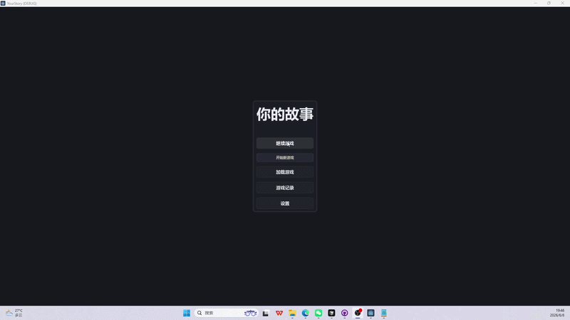
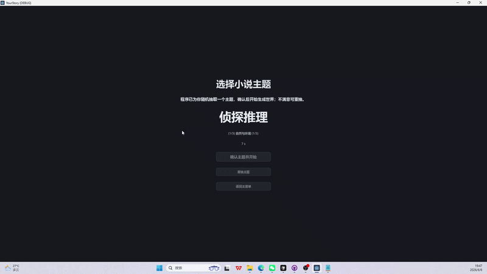
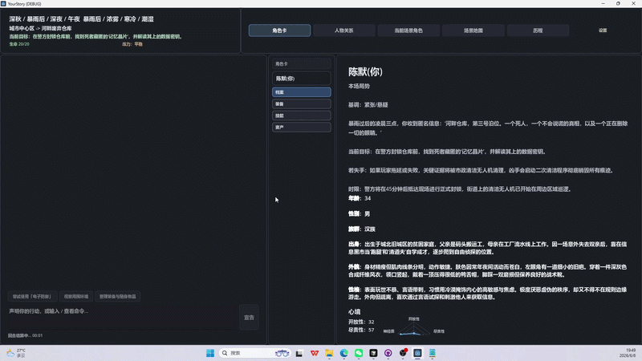
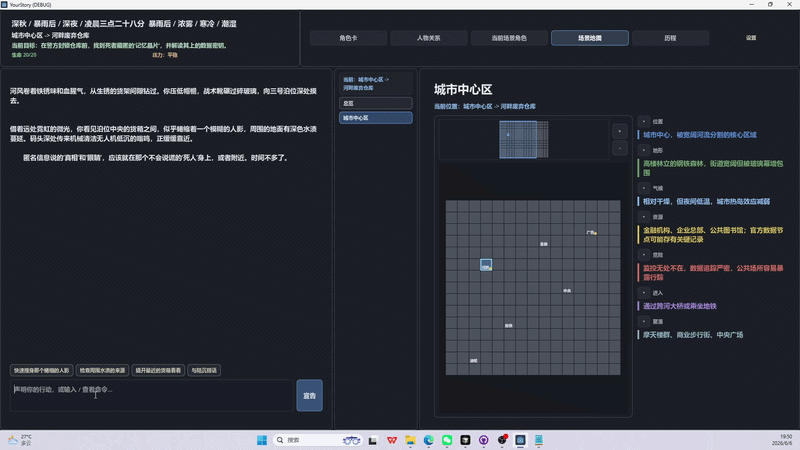
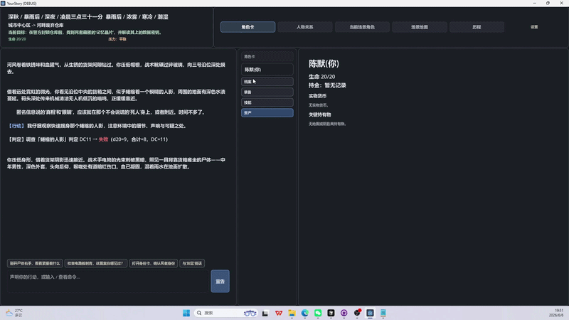
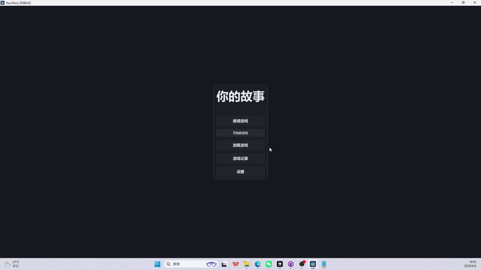

# Your Story

> 一款基于 AI 驱动的**类小说生成器**，让你以**游戏**的视角沉浸式体验小说世界。

## 项目简介

**Your Story（你的故事）** 将传统小说阅读与游戏化体验相结合。借助大语言模型，你可以：

- **以游戏的方式阅读小说** — 亲历主角的冒险，而非被动翻页
- **AI 实时生成剧情** — 每一次选择都通向不同的命运
- **沉浸式体验** — 文字、剧情、抉择融为一体

告别旁观者视角，在这里，**你即是主角**。

## 功能演示

### 1. 随机抽主题模式

不知道写什么？一键随机抽取故事主题，快速开启新冒险。

### 2. 世界初始化架构

开局由 AI 构建完整的世界观与叙事框架，为后续剧情奠定基调。

### 3. 角色信息卡

查看角色属性、背景与关系，随时掌握主角与世界中关键人物的状态。

### 6. 快捷文本生成与地图

通过快捷指令快速生成场景描述；地图功能帮助你把握故事发生的空间与方位。

### 8. DnD 风格对话逻辑

借鉴桌游跑团的交互方式，以选项与掷骰驱动对话，让每一次回应都充满不确定性。

### 9. 游戏记录与小说导出

自动保存冒险历程，并可将游玩过程整理导出为小说文本，把互动体验沉淀为可读作品。

## 简单体验

无需克隆源码或安装 Godot，Windows 用户可直接试玩：

1. 从 [github](https://github.com/youlinself/yourStory_public/blob/main/dist.zip) 下载 `dist.zip`
2. 解压到任意目录
3. 双击运行 `main.exe`

首次启动请在游戏内 **设置 → AI** 填写 API Key（需自行准备兼容 OpenAI API 的服务，见下方「环境要求」）。

## 许可证

本仓库采用**双组件许可**：

| 范围 | 许可 |
|------|------|
| Godot 源码、场景、Prompt 模板、测试等 | [GNU AGPL-3.0](LICENSE)（版权人：良思工作室） |
| `ai_backend/` 预编译二进制 | [伴生程序许可](ai_backend/LICENSE) |

第三方组件见 [THIRD_PARTY_NOTICES.md](THIRD_PARTY_NOTICES.md)。

## 环境要求

- **Godot Engine 4.6**（从 [godotengine.org](https://godotengine.org/download) 下载；勿将本地 Godot 放入 `.tools/` 并提交）
- **操作系统**：Windows（当前主要开发与导出平台；仓库内含 Linux / macOS 后端二进制）
- **AI 服务**：需自行准备兼容 OpenAI API 的 API Key（OpenAI、DeepSeek、MiniMax 等，见游戏内设置）

## 后续计划

- [ ] 支持 macOS / Linux 平台导出
- [ ] 更多剧情模板与世界观
- [ ] 角色自定义与存档系统增强
