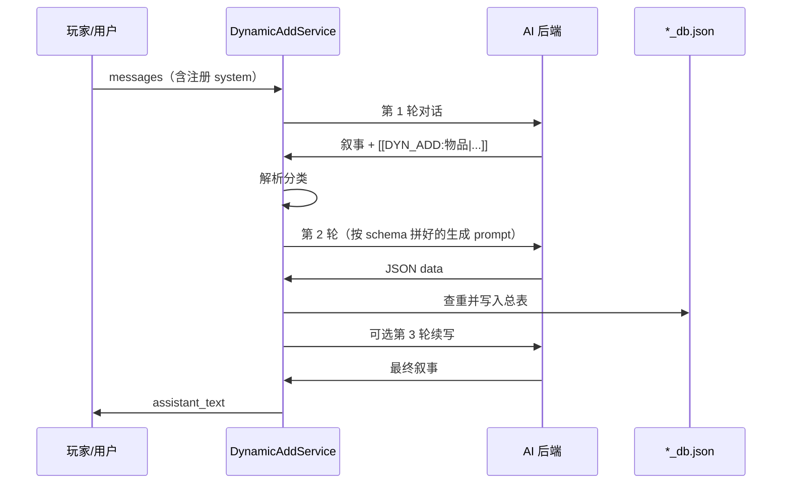

# dynamic_add 开发者说明

## 封装入口（游戏对话）

```gdscript
var dynamic_add := DynamicAddService.new()
add_child(dynamic_add)
dynamic_add.set_port(backend_port)

var messages := DynamicAddService.wrap_messages_with_skill_registration([
    {"role": "user", "content": "我撬开了生锈的医疗柜。"},
])

var result := await dynamic_add.chat_and_resolve(messages)
# result.assistant_text      — 最终叙事（标记已替换为【物品名】等）
# result.dynamic_add_results — 每条写入详情（含 request_index）
# result.processed_count     — 本轮实际处理条数
# result.truncated_count     — 超过上限被跳过的条数

# 自定义单次上限（默认 5，见 dynamic_add_registry.json）
dynamic_add.max_per_response_override = 8
```

`wrap_messages_with_skill_registration` 会把 `build_skill_registration_prompt()` 并入 system，完成**技能注册**。

## 流程



## 文件分工

| 路径 | 作用 |
|------|------|
| `dynamic_add_registry.json` | 分类别名、触发词示例 |
| `dynamic_add_schemas/*.json` | 各类型字段模板与入库目标 |
| `dynamic_add.routing.md` | AI 可读的简短协议 |
| `dynamic_add_service.gd` | 编排：注册 / 解析 / 生成 / 入库 / 续写 |
| `dynamic_add_trigger_parser.gd` | 解析 `[[DYN_ADD:...]]` |
| `dynamic_add_storage.gd` | 写入 `GameRunningFileManager` 总表 |
| `dynamic_add_prompt_builder.gd` | 拼装注册段与生成轮 prompt |

## 仅解析已有回复（不发起首轮对话）

```gdscript
var result := await dynamic_add.resolve_triggers_in_text(ai_text, world_context)
```

## 扩展新分类

1. 新增 `dynamic_add_schemas/{schema_id}.json`
2. 更新 `schemas_index.json` 与 `dynamic_add_registry.json` 的 `categories`
